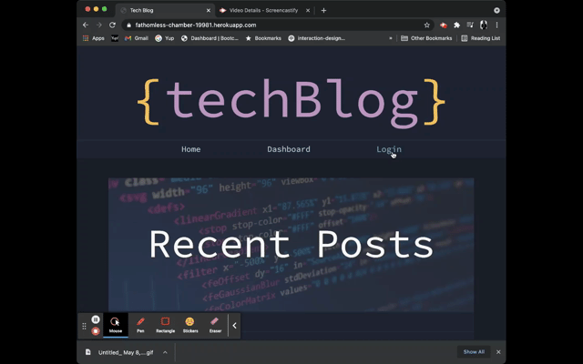
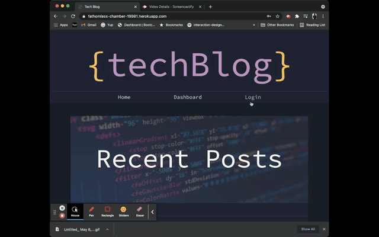

# techBlog/ 14-tech-blog

[](https://opensource.org/licenses/MIT)

- [Heroku](https://fathomless-chamber-19981.herokuapp.com/)
- [Repo](https://github.com/yondav/14-tech-blog)

## About / Synopsis

techBlog is a blogging platform for users to post their thoughts and engage in conversation via comments. Users will need to create an account to post on the site. Once logged in, users will have a personalized dashboard featuring their posts where they can select posts to edit or delete. techBlog was built using [sequelize](https://sequelize.org/) and [mysql](https://www.mysql.com/) and [express](http://expressjs.com/).

---

## Table of contents

> - [Title / Repository Name](#title--repository-name)
>   - [About / Synopsis](#about--synopsis)
>   - [Table of contents](#table-of-contents)
>   - [Installation](#installation)
>   - [Usage](#usage)
>     - [Config](#config)
>     - [Schema](#schema)
>     - [Seed](#seed)
>     - [Start Server](#start-server)
>   - [Author](#author)
>     - [Contact](#contact)
>   - [Contributing / Issues](#contributing--issues)
>     - [Contributing](#contributing)
>     - [Reporting Issues](#reporting-issues)
>   - [License](#license)

---

## Installation

- Clone repo
- Open integrated terminal on the root directory
- Install dependencies :
  [express](https://www.npmjs.com/package/express), [sequelize](https://www.npmjs.com/package/sequelize), [mysql2](https://www.npmjs.com/package/mysql2), [dotenv](https://www.npmjs.com/package/dotenv)

```
npm i
```

---

## Usage






---

### Config

Configure `.env.EXAMPLE`

- rename file to `.env`

```
DB_NAME=tech_blog_db
DB_USER=
DB_PW=
```

```
DB_NAME=tech_blog_db
DB_USER=root
DB_PW=Password
```

---

### Schema

`db` directory holds `schema.sql` with script to create database in Workbench or from the command line.

---

### Seed

`seeds` directory holds placeholder data to seed the database. Data can be changed to suit users needs or preference.

```
npm run seed
```

---

### Start Server

```
npm start
```

for `nodemon server.js`:

```
npm run watch
```

---

## Author

- <a href="https://yondav.us/">Yoni David</a>
- <a href="https://github.com/yondav">Github</a>

---

### Contact

Send emails to [yoni@yondav.us](mailto:yoni@yondav.us)

## Contributing / Issues

---

### Contributing

- Fork repo
- Make additions and changes on new, personalized branch
- Submit [pull request](https://github.com/yondav/14-tech-blog/pulls)

---

### Reporting Issues

Report issues by selecting the [issues](https://github.com/yondav/14-tech-blog/issues) tab and creating a new issue

---

## Licenses

- [MIT](https://github.com/yondav/14-tech-blog/blob/main/LICENSE)

This README file was built with [README Generator](https://github.com/yondav/README-gen-09)

Copyright &copy; 2021, Yoni David
